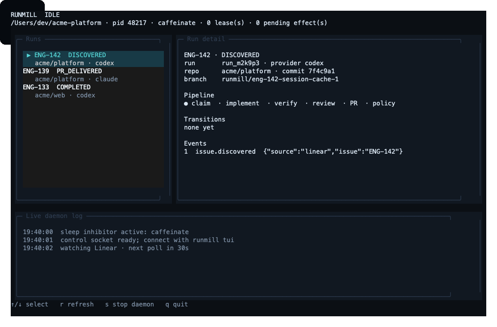

# Runmill

## Just give your agents a backlog

*Backlog-to-PR orchestration for coding agents*

Runmill continuously picks up eligible Linear issues, runs Codex or Claude Code in an isolated
workspace, verifies the exact candidate commit, starts a fresh-context review, opens the GitHub pull
request, waits for CI, and moves on to the next issue.

Your agents code. Runmill keeps the delivery loop moving. Deterministic orchestration controls
claims, workspaces, checks, repository side effects, pull requests, and merge policy.



The dashboard follows one issue from claim through implementation, exact-candidate checks,
fresh-context review, and PR delivery, then shows Runmill waiting for more work.

[Documentation](./docs/README.md) · [Configuration](./docs/configuration.md) ·
[Daemon operations](./docs/daemon.md)

## The delivery loop around your coding agents

A coding agent can complete one task. Runmill keeps the entire backlog-to-PR delivery loop
running.

Starting another agent session is easy. Operating a queue of real engineering work is not.
Someone still has to select eligible work, prevent duplicate claims, isolate each change, collect
the required evidence, get an independent review, deliver the pull request, and start again.

Runmill is not another coding agent and it does not replace CI. It operates the delivery loop
between Linear, Codex or Claude Code, your repository checks, and GitHub.

**Queue → Run → Verify → Review → Deliver → Repeat**

```text
queue → claim → implement → verify → fresh review → deliver
  ↑                                                      │
  └──────────────── wait for more work ←─────────────────┘
```

### Queue

Runmill watches Linear, filters eligible issues, routes each issue to the right repository, and
uses a Git-backed lease so two workers cannot take the same task.

### Run

Each issue gets an isolated workspace, a bounded task packet, an implementer, and explicit cost,
time, and risk limits. Durable state preserves the run through interruptions.

### Verify

Required checks run against the exact candidate commit in a clean checkout. Missing or stale
evidence stops the run.

### Review

A separate reviewer starts with fresh context and must account for every acceptance criterion.
Blocking findings enter a bounded fix loop; unresolved uncertainty escalates to a person.

### Deliver

Runmill pushes the branch, opens the pull request, waits for CI, applies the configured merge
policy, updates the backlog, and records the outcome.

### Repeat

Runmill takes the next eligible issue. When the queue is empty, it waits instead of terminating.

## One issue, one engineering run

An engineering run is Runmill's durable unit of work:

- the selected issue, repository, and base revision;
- implementer and reviewer configuration;
- candidate commit, check evidence, and independent review;
- intended and completed external side effects;
- pull request, CI, and merge-policy status; and
- the reason the work continued, stopped, retried, escalated, or entered quarantine.

SQLite is the system of record. `.runmill/log.md` is the readable, timestamped journal of completed
deliveries and merges.

## Your agents code. Runmill owns the delivery loop.

Codex or Claude Code implements and reviews the change. Runmill decides what is eligible, acquires
the lease, constructs the workspace, runs required checks, controls pushes and pull requests,
applies merge policy, and records every transition and external effect.

**Agents never own backlog mutations, pushes, pull requests, or merges; deterministic
orchestration code does.**

This is the boundary: language models propose and inspect software changes; deterministic code
owns workflow state and irreversible effects. Runmill does not claim the code is correct. It
records what was checked, what was reviewed, which policy ran, and why the change was allowed to
continue.

## Quick start

Runmill is not published to npm yet:

```bash
git clone https://github.com/mikigraf/runmill.git
cd runmill
npm ci
npm run build
npm link
```

Direct runtime and development dependencies are pinned to exact versions. `npm ci` installs the
lockfile without silently moving the agent execution stack underneath you.

In the repository you want it to manage:

```bash
runmill config create   # guided setup with discovered GitHub, Linear and agent options
runmill init            # add the check manifest and review rules
runmill doctor          # verify credentials, CLIs, Git and sandbox support
runmill next            # preview selection without changing anything
runmill daemon --detach # start the backlog worker in the background
runmill tui             # open the live interface from any directory
```

The setup wizard uses authenticated `gh`, Linear credentials, Codex, and Claude when available. It
lets you use installed CLI subscriptions or API keys, preloads repositories and Linear workflow
values, and writes conservative defaults. Secrets are never written to `runmill.yaml`.

For CI or scripted setup:

```bash
runmill config create --defaults
runmill config validate
runmill daemon --once
```

`--once` drains the work that is eligible now and exits. Without it, `daemon` checks the backlog
every 30 seconds while idle. Change that with `--poll-seconds`; use `--max-runs` for a bounded
session.

`runmill tui` is an OpenTUI dashboard for the running daemon. It discovers a user-private local
socket, so it works from any directory and does not need `runmill.yaml`. The dashboard shows live
daemon status and logs, recent runs, the active orchestration pipeline, transitions, agent events,
and pending external effects. It can also request a safe stop at the next run boundary. Runmill
automatically launches this one command with Bun because OpenTUI's native renderer needs it on the
Node versions Runmill otherwise supports.

## Try it without credentials

The included demo uses in-memory integrations:

```bash
cd examples/quickstart
RUNMILL_DEMO=1 npx tsx ../../src/cli/main.ts next --dry-run
RUNMILL_DEMO=1 npx tsx ../../src/cli/main.ts daemon --once
```

Demo mode is explicit. Runmill never silently substitutes a fake integration in production.

## Configuration

A minimal `runmill.yaml`:

```yaml
# yaml-language-server: $schema=./runmill.schema.json
version: 1
autonomy: pr-only

providers:
  implementer:
    implementation: codex
  reviewer:
    implementation: claude

backlog:
  provider: linear
  team: ENG
  eligible_states: [Todo, Ready]
  claim_state: In Progress
  delivered_state: In Review

github:
  repositories:
    - match: { team: ENG }
      repo: acme/platform
      base_branch: main
```

The implementer and reviewer may use the same CLI, different models, or different providers. A
different provider is useful, but not required: every review starts without the implementer's
history either way.

See the [configuration reference](./docs/configuration.md) for checks, budgets, risk paths,
repository routing, credentials, and merge policy.

## Start with well-scoped work

Runmill is best suited to issues with clear acceptance criteria, bounded repository scope,
deterministic checks, and repeatable review requirements: test repair, dependency maintenance,
narrow bug fixes, small refactors, type-safety work, and code-adjacent maintenance. Connect one
Linear team and one GitHub repository, start in `pr-only`, and let uncertain runs escalate.

## Built to keep the queue moving

- **A real idle state.** `daemon` waits for new Linear issues instead of exiting when the queue is
  empty. GitHub is currently the repository, CI, and pull-request integration; GitHub Issues is a
  declared backlog type but does not yet have a live adapter.
- **No laptop naps mid-run.** Runmill starts `caffeinate` on macOS or `systemd-inhibit` on Linux
  and releases it when the process stops.
- **Safe stopping.** `SIGINT` and `SIGTERM` finish the in-flight run boundary before exiting.
- **Circuit breakers.** Repeated failures, quarantines, escalation rates, and daily spend can stop
  the daemon before one bad condition is repeated across the backlog.
- **Durable state.** Leases, transitions, check evidence, and intended side effects survive a
  restart.
- **Operator-friendly output.** Human-readable commands by default; `--json`, stable exit codes,
  `inspect`, `list --needs-attention`, and `doctor --report` for automation and support.
- **A remote terminal UI.** Start with `runmill daemon --detach`, then use `runmill tui` anywhere
  on the same machine. The client reads daemon state over a `0600` Unix socket rather than guessing
  paths or opening the database itself.

## Autonomy modes

| Mode | Behavior |
|---|---|
| `observe` | Select and plan without claiming work or changing a repository |
| `pr-only` | Implement, verify, review, and open a pull request; never merge |
| `guarded-merge` | Merge eligible low-risk changes after every gate passes |
| `continuous` | Use guarded merge policy across repeated daemon runs |

`pr-only` is the default. A daemon can run continuously in any active mode; the autonomy setting
controls what each run may do, not whether the process stays alive.

## Evidence before delivery

- Git-ref leases prevent two workers from taking the same issue.
- Agent workspaces run under Seatbelt on macOS or bubblewrap on Linux.
- Required checks run against the exact candidate commit in a clean checkout.
- Reviews run with fresh context and must account for every acceptance criterion.
- Sensitive paths and incomplete evidence escalate instead of merging.
- Deterministic orchestration—not the agent—changes backlog state, pushes, opens PRs, and merges.

Runmill does not claim that an agent's code is correct. It records what was checked, what was
reviewed, which policy ran, and why the change was allowed to continue.

## Useful commands

| Command | Purpose |
|---|---|
| `runmill config create` | Create a config from discovered tools and integrations |
| `runmill config validate` | Validate the config and check manifest |
| `runmill config show` | Print the resolved config and defaults |
| `runmill doctor` | Check the host, credentials, agent CLIs, and sandbox |
| `runmill next` | Show the next issue and explain rejected candidates |
| `runmill prepare <issue>` | Check whether one issue is ready |
| `runmill run [issue]` | Process one issue |
| `runmill daemon` | Watch the backlog and process work continuously |
| `runmill daemon --detach` | Start the daemon in the background |
| `runmill daemon --once` | Drain eligible work and exit |
| `runmill tui` | Open the live OpenTUI dashboard from any directory |
| `runmill list --needs-attention` | Show runs waiting for a person |
| `runmill inspect <run-id>` | Show transitions, evidence, and pending effects |
| `runmill resume <run-id>` | Resume a paused run |
| `runmill policy explain <run-id>` | Explain a merge decision |
| `runmill auth status` | Show available credentials |
| `runmill auth login` / `runmill auth logout` | Add or remove a stored credential |
| `runmill skills eject` / `runmill skills validate` | Customize or validate review rules |
| `runmill state` | Check the local state store |
| `runmill gc` | Reconcile workspaces left by interrupted runs |
| `runmill eval validate <suite>` | Validate an evaluation suite |
| `runmill eval replay <suite>` | Replay historical tasks through the orchestration loop |
| `runmill feedback` | Create a support issue with diagnostics |

Every command supports `--json`, `--quiet`, and `--config <path>`. Run `runmill --help` for the
complete list.

## Requirements

- macOS or Linux, arm64 or x64
- Node.js 20.11 or newer
- Git and an authenticated GitHub account
- An authenticated Codex or Claude Code CLI
- Seatbelt on macOS or bubblewrap on Linux
- `caffeinate` on macOS or `systemd-inhibit` on Linux for sleep prevention
- Bun for `runmill tui` (the daemon and other commands only require Node)

Linear is currently the live backlog provider. GitHub handles source, pull requests, CI, branch
protection, and merges.

## Environment variables

| Variable | Purpose |
|---|---|
| `RUNMILL_DEMO=1` | Use the bundled in-memory integrations |
| `RUNMILL_FAKE_BACKLOG=<file>` | Load backlog issues from a JSON fixture |
| `RUNMILL_SOURCE_REPO=<path>` | Override the repository used to create run workspaces |
| `RUNMILL_DATA_DIR=<path>` | Override the state and workspace directory |
| `RUNMILL_DAEMON_REGISTRY=<path>` | Override daemon discovery, mainly for isolation and testing |

## Documentation

- [Daemon operation](./docs/daemon.md)
- [Configuration](./docs/configuration.md)
- [Run lifecycle and recovery](./docs/lifecycle.md)
- [Verification and check coverage](./docs/verification.md)
- [Autonomy and merge gates](./docs/autonomy.md)
- [Issue leases](./docs/leases.md)
- [Sandboxing](./docs/sandbox.md)
- [Historical evaluation](./docs/evaluation.md)
- [Errors](./docs/errors.md)
- [Contributing](./CONTRIBUTING.md)

## License

MIT. See [LICENSE](./LICENSE).
