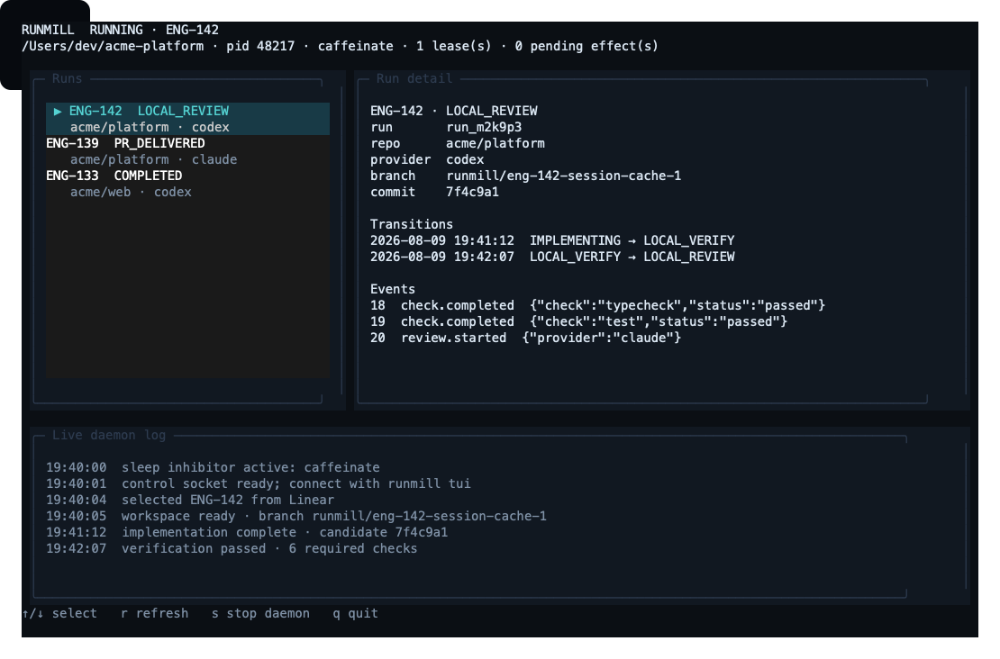

# Daemon operation

`runmill daemon` is the long-running mode. It watches the configured backlog, runs one issue at a
time, and waits when there is nothing eligible. Adding a new eligible issue is enough to wake the
work loop on its next poll.

```bash
runmill daemon
```

For normal unattended use, detach it and open the terminal interface:

```bash
runmill daemon --detach
runmill tui
```

The default idle poll interval is 30 seconds:

```bash
runmill daemon --poll-seconds 60
```

For a cron job, CI step, local test, or one-off batch, use drain mode:

```bash
runmill daemon --once
runmill daemon --once --max-runs 5
```

`--once` does not mean one issue. It processes everything currently eligible, then exits. Use
`--max-runs 1` when exactly one run is wanted.

## Idle and stop behavior

An empty queue is an idle state, not an error. Runmill prints the next poll time once, then stays
quiet until work appears or it is stopped. Selection is performed again after every poll, so state,
labels, priorities, leases, and repository routing are never cached across the idle period.

The daemon stops when:

- it receives `SIGINT` or `SIGTERM`;
- `--max-runs` is reached;
- a circuit breaker opens; or
- the queue drains in `--once` mode.

A signal takes effect between runs. Runmill lets the active orchestration boundary finish so it
does not abandon a lease or a half-recorded side effect.

## Keeping the host awake

Runmill holds a native sleep inhibitor for the complete daemon session and for individual
`runmill run` executions:

- macOS: `caffeinate` display, idle-sleep, disk, system-sleep, and user-active assertions
- Linux: a `systemd-inhibit` block for idle, sleep, suspend/hibernate, and lid-switch handling

This prevents display idle, system idle sleep, and suspend while work may be running. The helper
process is terminated when Runmill exits. No persistent power setting is changed.

If the native command is missing, Runmill prints a warning and continues. This is useful on
headless hosts where suspend is already disabled, while making the weaker guarantee visible on a
laptop.

## Reviews start clean

The reviewer is a separate agent invocation with a new context. It receives the issue, acceptance
criteria, diff, and verification evidence. It does not receive the implementer's conversation or
reasoning. Configure a different CLI or model under `providers.reviewer` when you also want an
independent model.

Review can send the change back through a bounded fix loop. New code from a fixer is verified and
reviewed again; it is never accepted on the strength of the fixer's claim.

## Operations and DevEx

Before leaving a daemon unattended:

```bash
runmill config validate
runmill doctor
runmill next
```

During and after operation:

```bash
runmill list
runmill list --needs-attention
runmill inspect <run-id>
runmill state
```

### OpenTUI dashboard

`runmill tui` connects to the active daemon over a user-private Unix socket. It can be launched
from any directory: configuration discovery, repository paths, and SQLite access remain inside the
daemon.



The CLI automatically delegates the TUI process to Bun. The
[OpenTUI native renderer](https://opentui.com/docs/getting-started/) currently needs Bun, or Node
26.4+ with experimental FFI; Runmill keeps Node 20 compatibility for the daemon and all non-TUI
commands. If Bun is missing, `runmill tui` exits with an installation hint rather than opening a
broken screen.

The dashboard includes:

- current daemon phase, process ID, repository, sleep inhibitor, and active issue;
- recent runs with state, repository, and provider;
- transition history, normalized agent events, and pending external effects for the selected run;
- a live daemon activity log; and
- a safe stop action that takes effect at the next orchestration boundary.

Keyboard controls:

| Key | Action |
|---|---|
| `↑` / `↓` | Select a run |
| `r` | Refresh immediately |
| `s` | Ask the daemon to stop safely |
| `q` or `Ctrl-C` | Close the TUI without stopping the daemon |

The registry is stored in `$XDG_RUNTIME_DIR/runmill/daemon.json` when available and otherwise in
`~/.runmill/daemon.json`. Both the registry and socket are mode `0600`. Only one active Runmill
daemon is registered per user session; one configuration can route issues across several
repositories.

Run state and evidence live in `.runmill/state`. Completed deliveries are also appended to
`.runmill/log.md` with local `DD/MM/YYYY HH:mm` timestamps, issue and PR links, result, cost, and
run ID. The Markdown file is an activity journal; SQLite remains the recovery source of truth.

Use `--json` for supervisors and scripts. Runmill uses stable exit codes and writes non-essential
human output only when `--quiet` is not set.

## Backlog support

The daemon is backlog-agnostic internally, but Linear is the current live issue adapter. GitHub is
used for repositories, pull requests, CI, branch protection, and merges. `github-issues` is
reserved in configuration but is not yet a live issue source; Runmill reports that clearly rather
than falling back to another source.

## Running in the background or as a service

`runmill daemon --detach` starts a background process and writes its standard output and errors to
`.runmill/state/daemon.log`. The control registry makes it discoverable by `runmill tui` regardless
of the TUI's working directory.

Foreground mode still works well under launchd, systemd, or a container supervisor. Native service
unit generation is not built in yet.

Whichever supervisor you use, give `SIGTERM` enough time for an in-flight issue to reach a safe
boundary. Do not configure the supervisor to restart a circuit-breaker exit immediately; that
would defeat the breaker.
